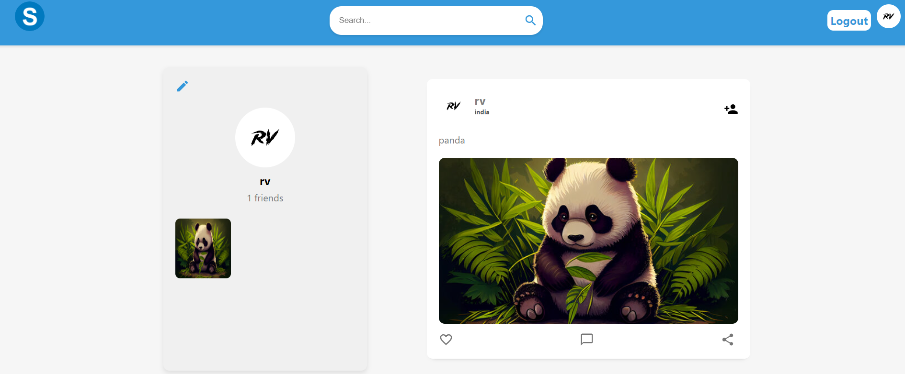

# Social

## Description

Full Stack Social-Media Web App built with MERN STACK

## Demo

[https://social-3jkt.onrender.com](https://social-3jkt.onrender.com)

## ScreenShots

### Authentication (signup / login / update)


### Add Friend


### Chat Page



## Tech Stack

**Client:** React JS

**Server:** Node JS, Express JS

**Database:** Mongo DB

**Image Uploading:** Cloudinary

## Features

- **Authentication**

- **Profile**

- **Update Profile**

- **Add Friend**

- **Remove Friend**

- **Create Post**

- **See All Posts**

- **See User Posts**

- **See Other User All Posts**

- **See Other User Profile**

## Installation

To run this project locally, follow these steps:

1. Clone the repository:

```bash
  git clone https://github.com/Yuvrajshankar/Social.git
```

2. Go to the project directory

```bash
  cd Social
```

3. Install dependencies

```bash
  npm install
```

```bash
  cd client/
  npm install
```

5. add **".env"** in root folder

```bash
PORT = 2648
MONGO_URI = "Mongo Url"
JWT_TOKEN = "secret token"
NODE_ENV = development
CLOUD_NAME = "Cloudinary Name"
API_KEY = "Cloudinary Secret Key"
API_SECRET = "Cloudinary Api Secret Key"

```

4. Start the server

```bash
  npm run server
```

5. Start the Client

```bash
  cd client
  npm start
```

## Made By

- [@Yuvrajshankar](https://github.com/Yuvrajshankar)

## License

This project is licensed under the [Apache License](LICENSE).
